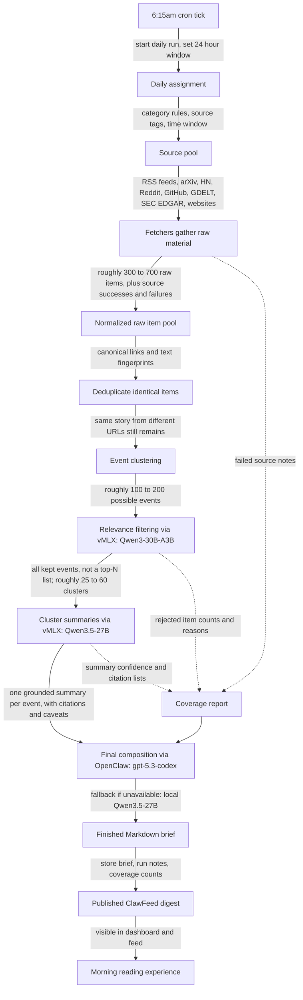

# How The Daily Brief Works

Every morning at 6:15am, the system wakes up and builds one finished intelligence brief from the sources you have chosen and the structured public sources assigned to your categories. It does not simply scrape a few feeds and ask a model to summarize them. It works more like a small newsroom: gather everything relevant from each beat, remove repeats, group different reports about the same real-world event, decide what deserves inclusion, turn each event into a grounded summary, then ask a stronger editor to assemble the final document.

## 1. The 6:15am Wake-Up

At 6:15am, OpenClaw triggers the daily brief run. Think of this as the newsroom lights turning on. The system decides, "We are producing the May 4 daily brief, covering the last 24 hours, from roughly 6:15am yesterday to 6:15am today."

What happens:

The run gets a clear time window. Every fetcher is asked to bring back material published or updated inside that window, with a little tolerance for sources that report time imperfectly. The system also prepares a place to record what happened during the run: which sources succeeded, which failed, how many items came in, which models were used, and whether the final document was composed by the frontier model or by the local fallback.

Why it exists:

Without this stage, every morning's brief would be vague about what "today" means. Some sources publish in UTC, some in Pacific time, some use no time zone at all, and some update old pages without changing the date. The run boundary gives the whole system a shared clock. It also makes the finished brief auditable later: you can ask, "What did this brief cover, and what did it miss because a source failed?"

What comes in:

The morning schedule, the daily 24-hour window, the current source settings, category definitions, and model routing choices.

What goes out:

A named daily run with a fixed window and a blank coverage report ready to be filled in.

## 2. The Daily Assignment

Before fetching begins, the system figures out what beats it is covering that morning. The categories are not just labels for the final brief. They shape what gets searched, what counts as relevant, and what evidence matters.

For example, "startup funding" might look at startup RSS feeds, GDELT news queries about funding rounds, and SEC Form D filings. "AI research" might look at arXiv categories and paper feeds. "AI coding tools" might look at RSS feeds, GDELT searches, Hacker News, Reddit, GitHub, and selected websites. "GitHub repositories gaining traction" uses both GitHub Trending as discovery and real star movement from stored daily snapshots.

What happens:

The system combines two kinds of sources. First, there are structured sources that live with the editorial categories, such as arXiv subject areas, SEC form types, GDELT searches, Hacker News lists, Reddit communities, and GitHub topic searches. Second, there are sources you add through the ClawFeed dashboard, such as a specific RSS feed or company blog. When you tag a source with a category, that source joins the daily source pool for that category.

The result is an assignment sheet for the morning. It says, in plain terms: "For startup funding, check these news feeds, these GDELT searches, and these SEC filings. For AI coding tools, check these product feeds, these GitHub topics, these HN and Reddit communities, and these websites."

Why it exists:

If this stage did not exist, the system would either be too rigid or too messy. It would be rigid if only hard-coded structured sources counted, because then adding a useful blog through the dashboard would not affect the brief. It would be messy if every source were global, because a startup funding feed could pollute the AI research section, and a research paper feed could pollute the funding section. The assignment stage makes the source pool both editable and category-aware.

What comes in:

Category definitions, source tags, active dashboard sources, the daily time window, and per-category search settings.

What goes out:

A concrete list of source tasks for all eight source families: RSS, arXiv, Hacker News, Reddit, GitHub, GDELT, SEC EDGAR, and websites.

## 3. Fetching: Reporters File From Each Beat

Fetching is the collection phase. This is where the system goes out into the world and gathers raw material. In the newsroom analogy, each fetcher is a reporter assigned to a specific beat.

The RSS reporter reads feeds from sites like TechCrunch, Hugging Face papers, company blogs, release notes, and any feed you have added. The arXiv reporter checks relevant research categories. The Hacker News reporter checks developer attention. The Reddit reporter checks selected communities. The GitHub reporter checks Trending for discovery, runs topic searches, and records star counts. The GDELT reporter checks broad news coverage. The SEC EDGAR reporter checks filings, especially Form D and amendments for financing signals. The website reporter checks configured pages, looking for pages or feeds that do not fit neatly into the other buckets.

What happens:

Each fetcher returns a pile of raw items. A raw item is not yet a brief entry. It is just a normalized record of something that was found: title, link, source, author if known, publication time if known, extracted text or abstract, short excerpt, and supporting details like score, comment count, filing type, GitHub stars, or Reddit subreddit.

Concrete morning numbers might look like this:

- RSS feeds produce 160 items.
- arXiv produces 70 papers.
- Hacker News produces 45 posts and discussions.
- Reddit produces 50 posts.
- GitHub produces 80 repository candidates plus star snapshots.
- GDELT produces 120 news mentions.
- SEC EDGAR produces 25 filings.
- Websites produce 20 extracted pages.

That gives roughly 570 raw items. On another day it might be 300. On a major AI news day it might be 900. The important point is that the system gathers broadly first. It does not try to decide too early what matters.

Why it exists:

The final brief can only be as good as the evidence pool. If the system only read a few RSS feeds, it might miss a funding round that appears first in SEC filings, or a new repository that shows up in GitHub search before anyone writes about it, or a developer backlash that surfaces on Hacker News before the official announcement is understood. Fetching all eight source families gives the later stages cross-source confirmation, which is the heart of the brief's quality.

This stage also records failures without stopping the run. If Reddit is rate limited, the brief still runs. If one website times out, the rest continue. The failure becomes part of the coverage report, not a reason to throw away the morning.

What comes in:

The source tasks from the daily assignment.

What goes out:

A large pool of raw items, plus a coverage trail showing which sources succeeded, which failed, and how many items each source produced.

## 4. Normalizing: Turning Different Source Shapes Into One Common Language

Each source speaks differently. A research paper has authors, abstract, subject areas, and a paper link. A Hacker News post has points and comment count. A GitHub repository has stars, forks, topics, age, and recent activity. An SEC filing has form type, company name, accession details, and filing date. A news article has title, outlet, body text, author, and publication time.

The system cannot reason cleanly over those directly. So it translates each find into the same basic item shape, while preserving source-specific details in the background.

What happens:

The title becomes a title. The best available URL becomes the URL. The clean version of that URL becomes the canonical link. The publication time is converted into a comparable time. The main text becomes content. The source-specific facts are kept as supporting details.

The system also creates two important fingerprints. One is based on the cleaned link. Another is based on the title and text. These are not shown to you in the brief, but they help the system notice repeats.

Why it exists:

Without normalization, every later stage would need special rules for every source family. The relevance filter would have to understand eight different formats. The deduplication step would miss obvious repeats. The final brief would be harder to ground in citations. Normalization turns a noisy evidence pile into something the rest of the system can inspect consistently.

What comes in:

Raw material from each fetcher, still shaped like its original source.

What goes out:

A unified raw item pool where every item can be compared, filtered, clustered, summarized, and cited.

## 5. First Deduplication: Removing Identical Or Near-Identical Copies

Now the system starts cleaning the pile. First it removes obvious duplicates: the same article found through two feeds, the same URL with tracking junk added, the same syndicated story copied across multiple pages, or the same item rediscovered because it appears in both a website and an RSS feed.

What happens:

The system cleans URLs by stripping tracking parameters, fragments, common mobile or AMP variants, and other noise. It also compares the content fingerprint created from the title and article text. If two items have the same cleaned link, they are treated as the same item. If they have different links but essentially identical text, they are treated as duplicate coverage of the same piece.

Suppose the 570 raw items from fetching include 90 obvious repeats. After this stage, the pool might drop to about 480 distinct items.

Why it exists:

Without this step, the brief would become annoying fast. The same TechCrunch story might arrive from TechCrunch RSS, a category feed, a company page, GDELT, and a user-added feed. You would see repeated evidence as if it were multiple developments. Deduplication prevents source volume from masquerading as importance.

This stage is not trying to decide whether two different articles are about the same event. It is only removing items that are effectively the same piece of content or the same link.

What comes in:

The unified raw item pool.

What goes out:

A cleaner item pool with identical and near-identical copies collapsed.

## 6. Event Clustering: Grouping Different Reports About The Same Thing

Deduplication catches repeated copies. It does not catch different reports about the same real-world event.

Imagine a startup announces a $40 million Series B. TechCrunch writes the company story. The company publishes a blog post. GDELT finds three business press mentions. SEC EDGAR shows a Form D filing. Hacker News discusses the launch angle. These are not duplicate articles. But they are one event.

That is what clustering handles.

What happens:

The system looks for items that share signals: similar titles, overlapping company names and people, the same dates, the same numeric facts, similar product names, similar repository names, matching URLs, or common source references. If items seem to be about the same event, they are grouped into an event cluster.

This is where the brief starts becoming about developments rather than pages. A cluster might contain one item, if only one source saw the event. It might contain ten items, if many sources covered it.

From the earlier example, 480 distinct items might become about 150 event clusters. Some clusters are one article. Some are a funding announcement plus filing plus company blog plus news coverage. Some are a research paper plus a Hacker News discussion. Some are a GitHub repository plus a Reddit thread plus a release note.

Why it exists:

Without clustering, the same event could appear under multiple angles. You might get one bullet saying "Company X raised a Series B," another saying "Company X filed Form D," another saying "Company X launched its AI platform," and another saying "Developers discuss Company X on Hacker News." That creates a false sense of many developments and makes the reader do the integration work.

Clustering also improves trust. A cluster can say, "This event is supported by a company post, two news articles, and a filing." Or it can say, "This appears only in one Reddit thread and should be treated as lower confidence." The system can preserve the difference between confirmed signal and chatter.

What comes in:

Distinct raw items after link and content deduplication.

What goes out:

Event clusters, each representing one likely real-world development with one or more supporting sources.

## 7. Relevance Filtering: The Section Editor Decides What Merits Ink

At this point, the system has a set of possible developments. Many are still not worth your morning attention. Some are outside the category. Some are old news being recirculated. Some mention AI only in passing. Some are generic thought pieces. Some are low-signal discussions. The relevance filter decides what survives.

This stage is handled locally by vMLX using Qwen3-30B-A3B. It is local because there may be hundreds of candidates, and this is high-volume judgment work. The model is not writing the final document here. It is acting like a section editor: "Does this belong in the brief? Which category? How strong is it? What kind of event is it? What evidence supports it? What is uncertain?"

What happens:

Each cluster, or sometimes a batch of related raw items, is compared against the category rules. The system asks questions like:

- Is this actually about a startup funding event, or just a startup mentioned in a general article?
- Is this paper likely to matter for AI research, agents, models, infrastructure, or developer tools?
- Is this repository gaining traction because star velocity is high, or merely because it appeared on GitHub Trending?
- Is this Hacker News discussion meaningful developer signal, or just a routine link with low substance?
- Is this product update material enough to include, or just a minor marketing post?

The filter does not choose a top five. It keeps every item that clears the bar. If 43 clusters are relevant, 43 clusters continue. If 71 are relevant on a busy day, 71 continue. Ranking comes later for ordering and emphasis, not for hiding relevant material.

Illustrative numbers:

- 150 clusters enter.
- 55 are rejected as off-topic, duplicative in meaning, stale, or too weak.
- 35 are rejected as incidental mentions or low-signal chatter.
- 60 survive as relevant.

On a quieter day, maybe only 25 survive. On a major launch day, more may survive. The cutoff is about relevance, not document length.

Why it exists:

Without relevance filtering, the brief would drown you in technically related but personally unimportant material. A search for AI coding tools will find SEO blog posts, shallow listicles, unrelated repositories with "AI" in the description, and discussions that are lively but not informative. The filter protects the brief from becoming a feed dump.

This is also where category-specific meaning matters. A GitHub repository with 200 stars may be irrelevant in one category and highly meaningful in another if it gained those stars overnight in a narrow topic you care about. A funding article might be high-signal if confirmed by multiple sources and low-signal if it is just rumor.

What comes in:

Event clusters, category rules, and source-specific evidence.

What goes out:

Kept clusters with relevance scores, category labels, event types, reasons for inclusion, named entities, evidence links, and uncertainty notes. Rejected clusters are counted and logged, but they do not proceed to the brief.

## 8. Cluster Summaries: Turning Evidence Into Grounded Brief Building Blocks

The kept clusters are still too raw for final reading. Each cluster may contain multiple articles, filings, discussions, and source-specific details. The system now turns each cluster into a compact, grounded summary.

This stage is handled locally by vMLX using Qwen3.5-27B. It is a stronger local writing and condensation model than the filtering model, and the task is lower-volume because most irrelevant material has already been removed.

What happens:

For each kept cluster, the model receives the cluster's supporting items and is asked to produce a structured summary in ordinary terms. It identifies the headline, the core facts, why it matters, the entities involved, caveats, source links, and a confidence level.

For a funding cluster, the summary might capture:

"VectorForge raised a $40 million Series B led by Northstar Ventures to expand its AI code review platform. The announcement is supported by the company blog, TechCrunch coverage, and a Form D filing. The filing amount is close to, but not exactly the same as, the announced round, so the brief should note that the filing appears to correspond to the round rather than state it as perfect confirmation."

For a GitHub cluster, the summary might capture:

"The open-source repository `agentflow-labs/taskgraph` gained roughly 1,800 stars in seven days, far above the normal threshold for its topic. It appears in GitHub Trending and is also being discussed on Hacker News. The README positions it as a workflow layer for coding agents, but production maturity is unclear."

Why it exists:

Without cluster summaries, the final composer would have to read every raw article and discussion directly. That would be wasteful and less reliable. More importantly, it would blur the separation between evidence gathering and document editing. Cluster summaries force each event to become a grounded building block before the final document is written.

This stage also gives the final composer better material. Instead of saying, "Here are 60 messy clusters, figure it out," the system says, "Here are 60 concise event summaries, each with citations, facts, caveats, and confidence." That is exactly the level where a strong frontier model can do its best editorial work.

What comes in:

Kept event clusters and their supporting source material.

What goes out:

One concise, citation-ready summary per kept event.

## 9. Final Composition: The Managing Editor Builds The Brief

Now the system has the raw ingredients of the final document: a coverage report and a set of grounded event summaries. This is the only point where the frontier model is used for the daily brief. OpenClaw sends the composition task to gpt-5.3-codex.

This stage is not about discovering facts. The facts should already be in the cluster summaries. The final composer acts like a managing editor: it lays out the issue, merges overlapping sections, catches repeated framings, orders the most important developments, preserves caveats, enforces the desired voice, and writes the connective prose.

What happens:

The final composer receives the category rules, the cluster summaries, the supporting links, and the coverage report. It writes a Markdown brief with sections such as Executive Read, Highest-Signal Developments, Startup Funding, AI Research, Models and Product Moves, AI Coding Tools, GitHub and Developer Signals, Watchlist, and Coverage.

The composer has several important responsibilities:

- It must include all relevant clusters that survived filtering.
- It may change ordering and emphasis, but it should not silently drop relevant events.
- It must avoid inventing uncited claims.
- It must notice when two summaries are really the same event under different names.
- It must preserve uncertainty instead of smoothing it away.
- It must make the document readable as a morning brief rather than a database dump.

If OpenClaw or the frontier model is unavailable, the system uses the strongest local model as fallback. The brief still publishes, but the coverage notes say that final composition used the local fallback. That way you get a document rather than a failed morning, while still knowing it was produced in degraded mode.

Why it exists:

Without final composition, you would have a pile of event summaries, not a brief. The difference matters. A brief has judgment. It tells you what led the day, what confirmed or contradicted what, where the interesting cross-source pattern is, and how to read the sections. A local model can write acceptable paragraphs, but the final frontier pass is better suited to structural editing: catching duplicate clusters across categories, resolving awkward ordering, maintaining voice, and noticing citation contradictions.

This is also why the system does not send hundreds of raw items to the frontier model. That would be expensive in attention, slow, and less controlled. The local models do the broad work. The frontier model does the high-leverage final edit.

What comes in:

Cluster summaries, category context, coverage data, and run notes.

What goes out:

One finished Markdown daily brief.

## 10. Publishing: Making The Brief Visible

The finished brief is saved into ClawFeed as a daily digest. This is the handoff from worker to reading experience.

What happens:

The final Markdown is stored with metadata about the run: time window, source counts, model choices, composition mode, number of raw items, number of clusters, number of kept clusters, and failed sources. The run is marked as published. The dashboard can then show the brief like any other ClawFeed digest.

The coverage section is part of the product, not an afterthought. It tells you whether the morning was healthy. A good coverage note might say:

"Sources attempted: 38. Sources succeeded: 35. Raw items: 542. Event clusters: 148. Kept clusters: 47. Failed sources: 3, including one Reddit community timeout and two website fetch failures. Final composition: gpt-5.3-codex."

Why it exists:

Without publishing, the pipeline would produce an artifact somewhere but not become part of your actual morning routine. Without metadata, you would have no way to tell whether a thin brief was thin because nothing happened or because half the sources failed. Publishing turns the run into a durable document and gives you a clear audit trail.

What comes in:

The finished brief and the run's coverage notes.

What goes out:

A visible daily digest in the ClawFeed dashboard and feed.

## 11. Why The Local-Then-Frontier Split Matters

The model split is central to the system's design.

The local models do the high-volume work. They can inspect hundreds of items, judge relevance, and summarize clusters without sending raw source material outside the machine. This keeps the broad reading local, fast enough, and inexpensive. It also means the frontier model never receives a giant pile of raw scraped content.

The frontier model does the final high-judgment pass. It sees condensed, already-filtered summaries and the coverage report. Its job is not to trawl the internet. Its job is to make the brief coherent and trustworthy as a document.

The division is similar to a newsroom. You would not ask the managing editor to read every wire story, every filing, every Reddit post, every GitHub README, and every paper abstract from scratch every morning. You would have beat reporters and section editors prepare clean notes first. Then the managing editor decides how the front page fits together.

What would go wrong without the split:

If everything went through the frontier model, the system would be slower, more brittle, and less private. It would also tempt the final model to overfit to raw noise. If everything stayed local, the brief would likely be adequate but less polished, with more risk of duplicate events across sections and weaker structural editing. The split uses each model where it helps the final document most.

## Worked Example: A Hypothetical Series B Funding Round

Imagine it is Tuesday morning. A startup called VectorForge announces a $40 million Series B for its AI code review platform.

The real world does not present that as one clean fact. It appears as a messy cloud:

- The company posts "VectorForge raises $40M Series B to scale AI code review."
- TechCrunch publishes an article with founder quotes and investor names.
- GDELT finds three business news mentions, two of which are syndicated rewrites.
- SEC EDGAR lists a Form D filing for VectorForge Technologies, Inc. showing a securities offering around the same amount.
- Hacker News has a discussion titled "VectorForge raises $40M for AI code review."
- A Reddit thread in a developer community asks whether VectorForge is different from existing coding agents.
- GitHub search finds the company's public SDK repository, which gained 600 stars in the last week after the announcement.

### Fetching

The RSS fetcher finds the TechCrunch article and the company blog post. GDELT finds the broader news mentions. SEC EDGAR finds the filing. Hacker News finds the discussion. Reddit finds the developer thread. GitHub records the repository and its star movement.

At this point, the system does not know whether this is important. It only knows these items exist. The raw pool might contain eight or nine VectorForge-related items.

### Normalizing

Each item is translated into the common item format.

The TechCrunch article becomes:

"Title: VectorForge raises $40M Series B for AI code review. Source: TechCrunch. Published: yesterday afternoon. Text: article body. Details: author, outlet, article URL."

The SEC filing becomes:

"Title: VectorForge Technologies, Inc. Form D. Source: SEC EDGAR. Published: yesterday. Details: filing type, company name, amount, filing link."

The Hacker News discussion becomes:

"Title: VectorForge raises $40M for AI code review. Source: Hacker News. Details: points, comments, discussion link, linked article."

The GitHub repository becomes:

"Title: vectorforge/sdk. Source: GitHub. Details: current stars, previous stars, stars gained per day, topics, repository age, README excerpt."

They are now comparable. The system can ask, "Are these the same link? The same text? The same event? The same company?"

### First Deduplication

Two of the GDELT news mentions turn out to be syndicated copies of the same article. One RSS item has a tracking-heavy URL, while another source found the clean URL. These collapse.

Maybe nine raw VectorForge items become seven distinct items. The system does not throw away the fact that multiple sources saw the story. It just avoids counting duplicate copies as separate developments.

### Event Clustering

The system notices that several items share the company name VectorForge, the $40 million amount, the Series B phrase, the same date, and overlapping investor names. It groups the company post, TechCrunch article, GDELT mentions, SEC filing, and HN discussion into one funding cluster.

The Reddit discussion may join the same cluster if it is clearly about the funding announcement. If it is mostly about the product category, it may become supporting developer-signal evidence or a related but separate cluster.

The GitHub repository might attach to the funding cluster as supporting signal if the star jump is clearly tied to the announcement. Or it might become a separate "repos gaining traction" cluster if its star velocity independently clears the threshold for AI coding tools. This is where the final composer later helps avoid double-counting. It might mention the repo inside the funding item rather than create a separate duplicate bullet.

The important transformation is this: the system no longer sees "seven pages." It sees "one funding event, with multiple evidence types."

### Relevance Filtering

The local relevance model examines the funding cluster against the startup funding and AI coding tools categories.

It decides:

"Keep. Category: startup funding, with secondary relevance to AI coding tools. Event type: Series B financing. Score: high. Reason: financing amount is material, company is in an important AI developer tooling area, and the event is supported by multiple sources including a company announcement, news coverage, and a filing. Uncertainty: SEC filing appears to match the round but should be phrased carefully unless exact correspondence is confirmed."

It also examines the Reddit discussion.

If the Reddit thread is mostly shallow debate, it might decide:

"Do not keep as its own event. Use as supporting signal only if already attached to the funding cluster."

If the Hacker News discussion has unusually high developer engagement, it might preserve that as a detail:

"Developer interest is meaningful. Include comment count or discussion link if relevant."

No top-N limit is applied. The cluster survives because it passes the relevance bar, not because it happened to rank in the top five.

### Cluster Summary

The stronger local summary model receives the kept VectorForge cluster and turns it into a compact brief-ready building block:

"VectorForge raised a $40 million Series B led by Northstar Ventures to expand its AI code review platform. The round is covered by TechCrunch and the company blog, with a Form D filing that appears consistent with the financing. The company is positioning itself as an automated review layer for engineering teams using AI coding agents. Developer discussion is active on Hacker News, and the public SDK saw a sharp star increase after the announcement. Caveat: the filing should be treated as corroborating evidence unless the company explicitly ties it to the announced round."

That summary includes the key facts, why it matters, source links, caveats, and confidence. It is still not the final brief prose. It is a building block.

### Final Composition

The frontier composer sees the VectorForge cluster summary along with all other kept clusters from the morning.

It decides where VectorForge belongs. It might appear in "Startup Funding" with a cross-reference in "AI Coding Tools." Or, if the morning has many funding rounds, it might appear in "Highest-Signal Developments" because it connects funding, developer tooling, GitHub velocity, and HN discussion.

The final brief entry might read:

"VectorForge raised a $40 million Series B for its AI code review platform, with TechCrunch and the company announcement naming Northstar Ventures as lead investor. A Form D filing appears to corroborate the financing, though the brief should treat it as aligned evidence rather than exact confirmation unless the company ties the filing directly to the round. The story also has developer-signal weight: its SDK repository gained stars sharply after the announcement, and the Hacker News discussion is active. The practical read is that investor interest is still flowing into the review-and-agent layer around AI coding, not only into full autonomous coding systems."

That entry is not just a summary of one article. It is an integrated read of the event across news, filings, developer attention, and repository velocity.

### Publishing

The finished daily brief is saved. The coverage footer might say:

"VectorForge cluster sources: company blog, TechCrunch, GDELT, SEC EDGAR, Hacker News, GitHub. Confidence: high for the funding announcement, medium for the filing correspondence."

The dashboard shows the brief. You read one coherent entry instead of chasing eight tabs.

## What This System Is Not

This system is not a guarantee of total internet awareness. It can be comprehensive across configured categories and configured source families, but it cannot find a story that appears nowhere in the sources it checks. If a funding round is mentioned only in a paywalled newsletter that is not configured, the system will not magically know about it.

It is not a guarantee that broad public indexes catch everything. GDELT is useful and wide, but it is not the whole web. RSS feeds are excellent when publications maintain them, but not every site does. GitHub search and Trending are useful signals, but they reflect public repository activity, naming, topics, and rate limits. SEC EDGAR is authoritative for filings, but not every financing event appears there in a clean or immediate way.

It is not a paywall breaker. If a source exposes only a headline and a short excerpt, the system can use that. If it cannot extract the full text, it should not pretend it read the full article. The final brief should reflect the evidence actually available.

It is not a truth machine. It can compare sources, notice corroboration, preserve caveats, and separate high-confidence evidence from rumor. It cannot prove that a company claim is true in the philosophical sense. It judges relevance, signal strength, corroboration, and uncertainty.

It is not a top-N newsletter. The brief is not designed to show only five stories because five is tidy. If 52 developments pass the relevance filter, the system should include 52, organized clearly. Ordering and section placement create readability, but they do not erase relevant material.

It is not a replacement for judgment. The system is meant to give you a strong morning map: what happened, what appears confirmed, what is noisy, what is developing, and where the evidence came from. The final act of interpretation is still yours.
